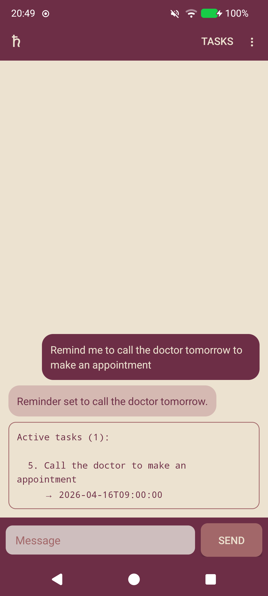

# Saturn ♄

An Android task nudge assistant. You chat with an AI agent to track tasks and commitments; it sends you reminders at the right time.



## What it does

- Chat with an AI agent to add, update, and complete tasks
- Agent schedules reminders based on task descriptions and your availability
- Notifications fire at the scheduled time; replies appear in chat when you open the app
- Recurring tasks (↻) are rescheduled automatically after each nudge

## Setup

1. Get an API key from [openrouter.ai](https://openrouter.ai)
2. Install the APK
3. Open the app → ⋮ → Settings
4. Enter your API key and save
5. Grant the "Alarms & reminders" permission when prompted (required for exact timing)

## Settings

| Field | Description |
|-------|-------------|
| API key | OpenRouter key (`sk-or-v1-...`) |
| Model | Any model available on OpenRouter. Default: `openai/gpt-oss-120b:free` |
| Timezone | Your local timezone (e.g. `Europe/Rome`) |
| Language | English or Italian |
| Schedule | Freeform description of your availability (e.g. `weekdays 9–13 and 15–19`) |

## Building

Requires a Nix shell (`nix-shell`) which provides JDK 17, Gradle, and the Android SDK.

```sh
make          # build debug APK
make install  # build and install on connected device
make run      # build, install, and launch
make logcat   # stream filtered logs
```

## Architecture

| Component | Role |
|-----------|------|
| `MainActivity` | Chat UI |
| `SettingsActivity` | API key, model, timezone, language, schedule |
| `Database` | SQLite task store |
| `AgentClient` | HTTP to OpenRouter, prompt builders, JSON parsing |
| `ActionExecutor` | Applies agent actions (add/update/complete/delete task) |
| `NudgeService` | Foreground service: runs nudge cycle when alarm fires |
| `NudgeReceiver` | BroadcastReceiver — wakes `NudgeService` on alarm |
| `NudgeScheduler` | Sets/cancels the next one-shot exact alarm |
| `BootReceiver` | Reschedules alarm after reboot |
| `KeystoreHelper` | AES-256-GCM encryption of API key via Android Keystore |

No Android Studio, no Gradle wrapper, no AndroidX. Plain Java, XML layouts, and a Makefile.

## See also

Saturn is the Android port of [nudgent](https://github.com/gosub/nudgent), a Go/Telegram bot that does the same thing server-side.
