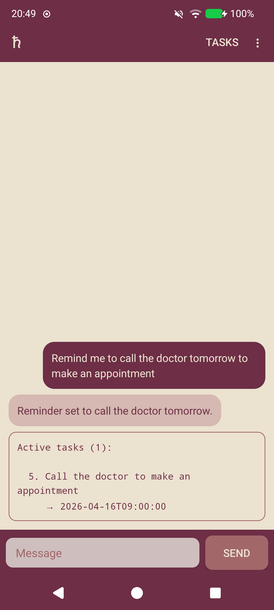

# Saturn ♄

[](LICENSE)

An agentic alarm clock for Android — you say what, it handles when.



## What it does

- Chat with an AI agent to add, update, and complete tasks
- Agent schedules reminders based on task descriptions and your availability
- A Tasks screen lists everything grouped by when it next fires (Today / This week / Later / No reminder); complete, snooze, reschedule, edit, or delete a task directly — no model call — or ask the agent to change one in plain language
- Notifications fire at the scheduled time, one per due task, each with Done / Snooze buttons; replies appear in chat when you open the app
- Reminders fire even when the model is unreachable (raw task text, retried with backoff)
- Recurring tasks (↻) are rescheduled after each nudge, with a deterministic fallback if the model forgets; daily/weekly tasks keep their wall-clock time across DST
- English and Italian UI; all times use the device timezone

## Setup

1. Get an API key from [openrouter.ai](https://openrouter.ai)
2. Install the APK and open it — it takes you to Settings
3. Enter your API key and save
4. Grant the "Alarms & reminders" permission when prompted (required for exact timing)

## Settings

| Field | Description |
|-------|-------------|
| API key | OpenRouter key (`sk-or-v1-...`) |
| Model | Any model available on OpenRouter. Default: `openai/gpt-oss-120b:free` |
| Language | English or Italian |
| Schedule | Freeform description of your availability (e.g. `weekdays 9–13 and 15–19`) |

## Building

Requires a Nix shell (`nix-shell`) which provides JDK 17, Gradle, and the Android SDK.

```sh
make          # build debug APK
make install  # build and install on connected device
make run      # build, install, and launch
make test     # run unit tests
make logcat   # stream filtered logs
```

## Architecture

| Component | Role |
|-----------|------|
| `MainActivity` | Chat UI |
| `TasksActivity` | Task screen: time-bucketed list with direct (mostly LLM-free) actions |
| `SettingsActivity` | API key, model, language, schedule |
| `Database` | SQLite store for tasks and chat messages (single source of model context); implements `TaskStore` |
| `TaskStore` | Persistence interface `ActionExecutor` depends on (in-memory fake in tests) |
| `AgentClient` | HTTP to OpenRouter, prompt builders (chat / nudge / single-task edit), JSON parsing |
| `ActionExecutor` | Applies agent actions to the DB (each in a transaction), returns structured `Receipt`s |
| `ReceiptFormatter` | Renders `Receipt`s as localized lines, shared by both screens |
| `LocaleHelper` | Applies the in-app language as the context locale (no AndroidX) |
| `NudgeService` | Foreground service: runs nudge cycle when alarm fires |
| `NudgeReceiver` | BroadcastReceiver — wakes `NudgeService` on alarm |
| `NudgeActionReceiver` | Handles Done / Snooze notification buttons locally (no LLM) |
| `NudgeScheduler` | Sets/cancels the next one-shot exact alarm |
| `BootReceiver` | Reschedules alarm after reboot |
| `KeystoreHelper` | AES-256-GCM encryption of API key via Android Keystore |

No Android Studio, no Gradle wrapper, no AndroidX. Plain Java, XML layouts, and a Makefile.

## See also

Saturn is the Android port of [nudgent](https://github.com/gosub/nudgent), a Go/Telegram bot that does the same thing server-side.
